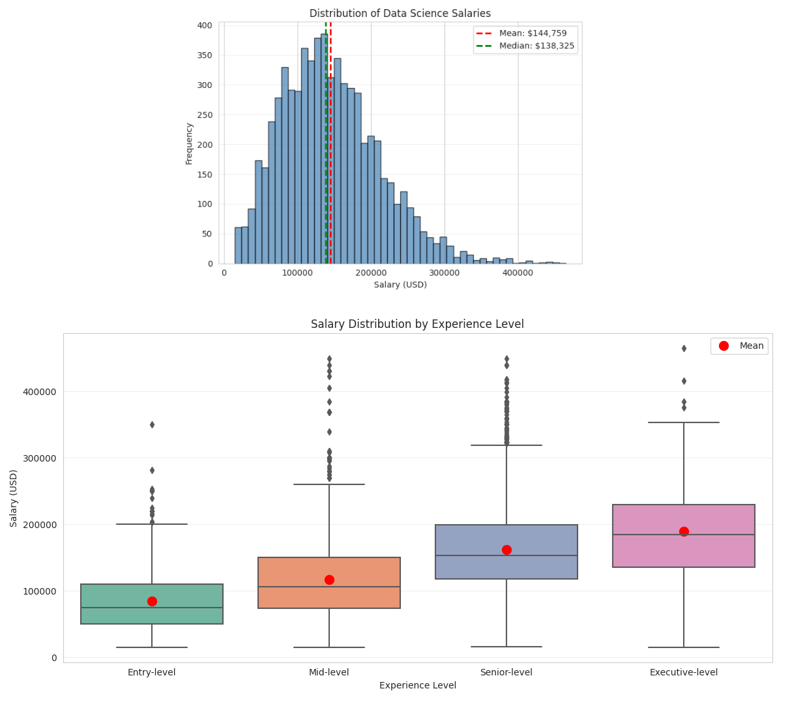
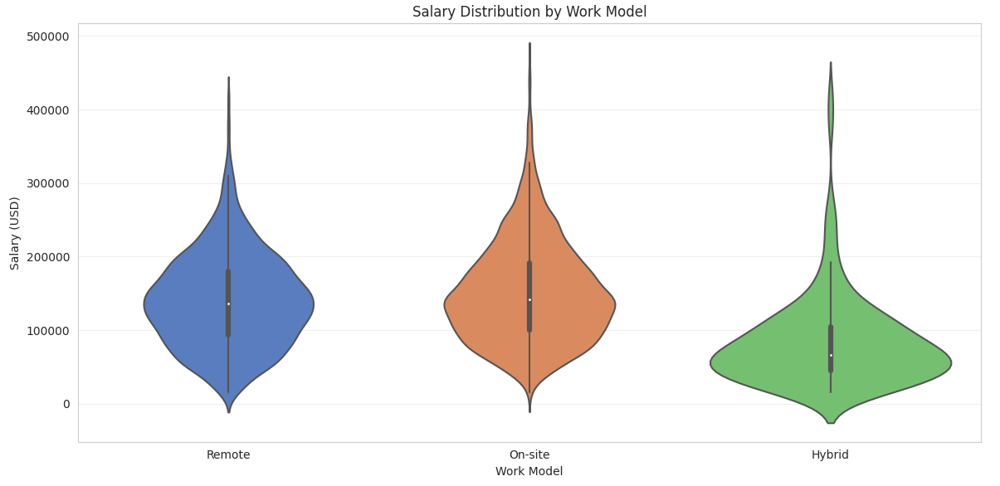

# Data Science Salary Analysis (2020-2024)

**Exploratory analysis of 6,600 data science professionals to identify compensation drivers and market trends.**



## 🎯 Key Findings

1. **Experience matters most**: Each level jump = $30-40k increase
2. **Remote discount is minimal**: Only 8% lower than on-site (vs expected 20%+)
3. **Location premium**: US roles pay 35% more than international
4. **Title matters less than expected**: Senior Data Analyst > Junior ML Engineer

[See detailed analysis →](salary-analysis.ipynb)

## 📊 Methodology

- **Data Source**: Kaggle Data Science Salaries 2024
- **Tools**: Python (pandas, matplotlib, seaborn)
- **Sample Size**: 6,590 records
- **Time Period**: 2020-2024

## 🔍 Analysis Highlights

### Salary Distribution by Experience


### Work Model Impact


[View all visualizations →](visualizations/)

## 💼 Business Implications

**For Job Seekers:**
- Focus on experience progression over job title optimization
- Remote work doesn't significantly reduce compensation
- US market offers 35% premium even for remote roles

**For Employers:**
- Market rate for Senior DS: $150-160k
- Remote discount should not exceed 10%
- Experience level is key retention factor

## 🛠️ Technical Details

**Libraries Used:**
```python
pandas, numpy, matplotlib, seaborn
```

**How to Run:**
```bash
pip install -r requirements.txt
jupyter notebook salary-analysis.ipynb
```
